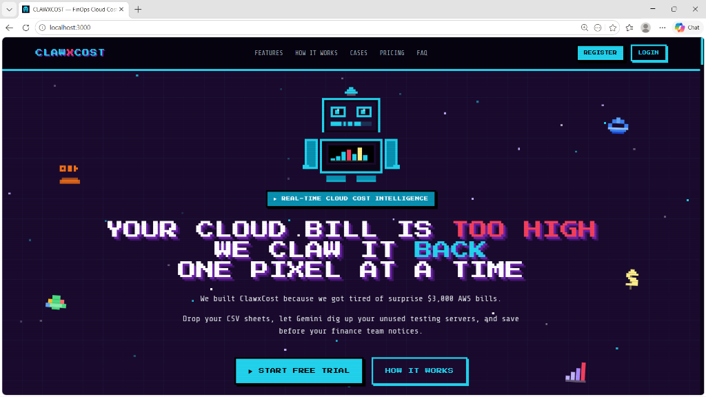

<h1 align="center">
  <span style="color: #22d3ee; font-family: 'Courier New', monospace; font-weight: bold; text-shadow: 3px 3px 0px #6b21a8; letter-spacing: 2px;">CLAW</span><span style="color: #f43f5e; font-family: 'Courier New', monospace; font-weight: bold; text-shadow: 3px 3px 0px #6b21a8; letter-spacing: 2px;">X</span><span style="color: #22d3ee; font-family: 'Courier New', monospace; font-weight: bold; text-shadow: 3px 3px 0px #6b21a8; letter-spacing: 2px;">COST</span>
</h1>

<p align="center">
  <strong>ClawxCost is a platform with a goal to reduce your cloud costs.</strong>
</p>

It pulls in billing data from AWS, Azure, or GCP, makes sense of it, spots unusual spending patterns, and gives you AI-powered suggestions on where to cut costs — all through a clean dashboard with a retro pixel-art look.

Sign in with your Google account, upload your billing data (CSV or manually), and you get a personal dashboard. Your data stays yours — nobody else can see it.

---

## Visual Demonstration

### 👾 Retro Pixel-Art Landing Page
Here is the interactive landing page of ClawxCost featuring retro-cyber robot metrics, neon telemetry lines, and intuitive navigation:



### 📸 Full Feature Screenshot Tour
We have created a separate, detailed visual guide showcasing all 15 screens of the user and administrator dashboards. Check out the **[Frontend Feature Showcase (README.md)](Frontend/README.md)** to view screenshots of every page, chart, and alert in detail.

---

## What does it actually do?

Think of ClawxCost as a smart assistant that watches your cloud bills and tells you:

- **"Hey, your AWS costs spiked 2x this week"** → Anomaly detection
- **"You're spending 80% of your budget on one provider"** → Concentration risk alert
- **"You could save $1,354/month by rightsizing your EC2 instances"** → Recommendations
- **"Ask me anything about your costs"** → Gemini AI chat

---

## Tech Stack

**Frontend**
- React 18 + Vite 5
- Tailwind CSS
- React Router
- Google OAuth button (`@react-oauth/google`)

**Backend**
- Node.js + Express
- MongoDB (via Mongoose)
- JWT for authentication
- Google Gemini AI SDK
- Multer + csv-parse (for CSV uploads)

**External Services**
- Google OAuth 2.0 (login)
- Google Gemini API (AI chat)

---

## Project Structure

```
clawxcost/
│
├── Frontend/               ← React app (runs on port 3000)
│   └── src/
│       ├── pages/          ← Landing, Login, Dashboard, AI Insights
│       ├── components/     ← Navbar, Footer, buttons, charts, cards
│       ├── context/        ← AuthContext (stores login state)
│       └── hooks/          ← Reusable logic (scroll reveal, data fetching)
│
└── Backend/                ← Express API (runs on port 5000)
    ├── routes/             ← URL definitions
    ├── controllers/        ← Handle incoming requests
    ├── services/           ← Business logic (billing, AI, anomaly detection)
    ├── models/             ← MongoDB schemas
    └── middleware/         ← Auth checks, error handling, logging
```

---

## How it Works

### 1. Login

You click "Sign in with Google" → Google gives us a token → we verify it, create your account if it's your first time, and give you a session token (JWT). That token is attached to every request you make, so we always know it's you.

### 2. Upload Billing Data

You can upload a CSV file or add records one by one. Each record needs:

```
provider (aws / azure / gcp)
service  (e.g. EC2, Cloud Storage)
region   (e.g. us-east-1)
cost     (in USD)
hours    (usage hours)
date
```

The moment you upload, things happen automatically in the background:

```
Your CSV
   ↓
Raw record saved (exactly as you uploaded)
   ↓
Normalized (converted to a common format, regardless of cloud)
   ↓
Trends calculated (7-day rolling averages)
   ↓
Anomalies detected (cost spikes, risky spending patterns)
   ↓
Recommendations generated (how to save money)
```

Your dashboard updates within a second or two.

### 3. Read Your Dashboard

You'll see:
- **Total spend** broken down by provider and service type
- **Trend charts** — is spending going up or down this week?
- **Incidents** — active alerts you need to look at
- **Recommendations** — concrete actions with estimated savings

### 4. Chat with AI

Open the AI Insights page and ask anything:

> *"What's driving my AWS costs?"*
> *"Which service should I cut first?"*
> *"Compare my GCP vs AWS spend."*

Gemini AI has access to your actual cost data when answering, so responses are specific to your situation — not generic advice.

---

## Getting Started

### What you need

- Node.js 18+ and npm 9+
- MongoDB running locally (or a MongoDB Atlas connection string)
- A Google Cloud project (for login)
- A Gemini API key (optional — you can add this later from the admin panel)

### Step 1 — Clone and install

```bash
git clone https://github.com/your-org/clawxcost.git
cd clawxcost

cd Backend && npm install
cd ../Frontend && npm install
```

### Step 2 — Set up environment variables

Create `Backend/.env`:

```env
PORT=5000
MONGO_URI=mongodb://localhost:27017/clawxcost
JWT_SECRET=pick-a-long-random-string
JWT_EXPIRY=24h
GOOGLE_CLIENT_ID=your-google-client-id
GEMINI_API_KEY=your-gemini-api-key   # optional, can be set later
```

Create `Frontend/.env`:

```env
VITE_API_URL=http://localhost:5000
VITE_GOOGLE_CLIENT_ID=your-google-client-id
```

> See [Environment Variables](#environment-variables) for how to get these keys.

### Step 3 — Start everything

Open 3 terminal tabs:

```bash
# Tab 1 — Database
mongod

# Tab 2 — Backend
cd Backend && npm run dev

# Tab 3 — Frontend
cd Frontend && npm run dev
```

### Step 4 — Open the app

Go to **http://localhost:3000** and sign in with Google.

To verify the backend is alive:
```bash
curl http://localhost:5000/health
# → { "status": "OK", "message": "Clawxcost API running" }
```

---

## Environment Variables

### Getting your Google OAuth Client ID

1. Go to [Google Cloud Console](https://console.cloud.google.com/)
2. Create a project → **Credentials** → **Create OAuth Client ID**
3. Type: **Web Application**
4. Add `http://localhost:3000` as an authorized redirect URI
5. Copy the **Client ID** — paste it in both `.env` files

### Getting your Gemini API Key

1. Go to [Google AI Studio](https://makersuite.google.com/app/apikey)
2. Click **Create API Key**
3. Paste it in `Backend/.env` — or skip this and set it later from the Admin Panel inside the app

---

## Pages & Routes

| URL | Who can access | What it is |
|---|---|---|
| `/` | Everyone | Landing page |
| `/login` | Everyone | Google sign-in |
| `/signup` | Everyone | Account creation |
| `/dashboard/admin` | Logged in | Admin dashboard (billing upload, incidents) |
| `/dashboard/user` | Logged in | User dashboard (cost summary, recommendations) |
| `/ai-insights` | Logged in | Gemini AI chat |

---

## Security

**Login:** We use Google OAuth — no passwords are stored anywhere.

**Sessions:** After login, you get a JWT token valid for 24 hours. It's stored in your browser's localStorage. Every API call includes it.

**Your data is yours:** Every piece of data in the database is tagged with your user ID (from your login token). The backend ignores any user ID you might try to send in a request — it only trusts what's in your verified token. User A literally cannot see User B's data.

**API keys:** Your Gemini API key is stored securely in the database. It's never sent to the browser and only used server-side.

---

## Deployment

### Local development (3 terminals)

```bash
mongod                          # Database
cd Backend && npm run dev       # API server
cd Frontend && npm run dev      # React app
```

### Production build

```bash
# Build the frontend
cd Frontend && npm run build

# Start the backend in production mode
cd Backend && npm start
```

### Production environment variables

```env
# Backend/.env
JWT_SECRET=<very-long-random-string>
GOOGLE_CLIENT_ID=<your-production-google-client-id>
GEMINI_API_KEY=<your-gemini-key>
MONGO_URI=<mongodb-atlas-url>

# Frontend/.env
VITE_API_URL=https://your-api-domain.com
VITE_GOOGLE_CLIENT_ID=<your-production-google-client-id>
```
---

## What's Coming Next

| Phase | What gets built | Status |
|---|---|---|
| 1 | Billing ingestion, normalization, 7-day trends | ✅ Done |
| 2 | Anomaly detection (spikes, concentration risks) | ✅ Done |
| 3 | Google OAuth + JWT + multi-user isolation | ✅ Done |
| 4 | Gemini AI chat with cost context | ✅ Done |
| 5 | CSV bulk upload + admin key management panel | ✅ Done |

---
