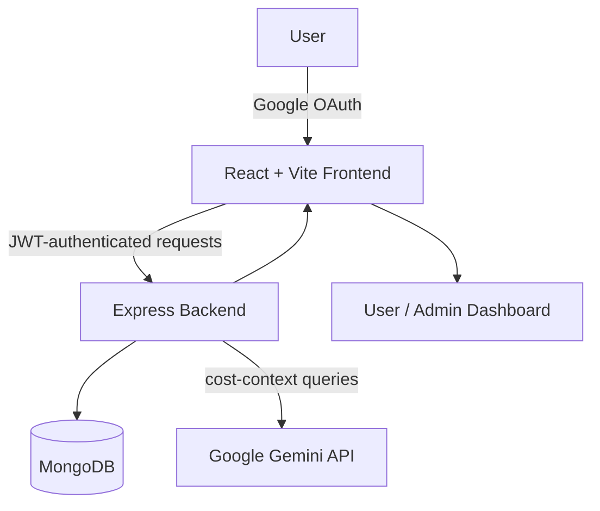
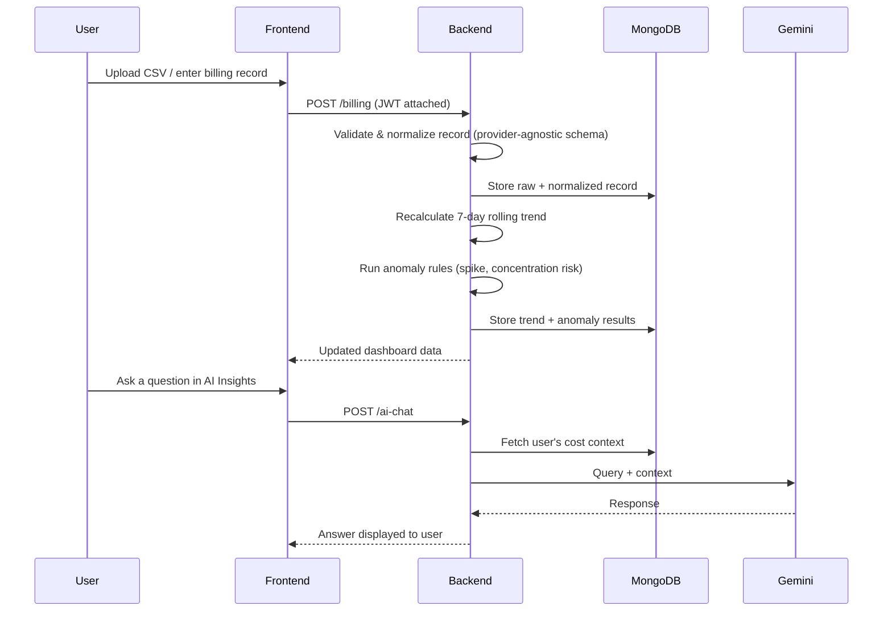
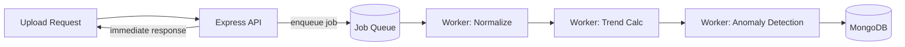
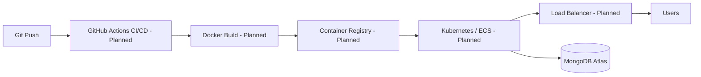

<h1 align="center">
  <span style="color: #22d3ee; font-family: 'Courier New', monospace; font-weight: bold; text-shadow: 3px 3px 0px #6b21a8; letter-spacing: 2px;">CLAW</span><span style="color: #f43f5e; font-family: 'Courier New', monospace; font-weight: bold; text-shadow: 3px 3px 0px #6b21a8; letter-spacing: 2px;">X</span><span style="color: #22d3ee; font-family: 'Courier New', monospace; font-weight: bold; text-shadow: 3px 3px 0px #6b21a8; letter-spacing: 2px;">COST</span>
</h1>

<p align="center"><strong>AI-assisted multi-cloud cost monitoring and optimization platform.</strong></p>

---

## 1. Overview

**Problem.** Teams running workloads across AWS, Azure, and GCP typically view cost data in three disconnected consoles, in three different formats, with no unified view of total spend or unusual patterns.

**Solution.** ClawxCost ingests billing data from all three providers (via CSV upload or manual entry), normalizes it into a single schema, computes rolling spend trends, flags anomalies, and lets a user ask natural-language questions about their own cost data via Gemini.

**Business value.** Faster anomaly detection means faster corrective action on cost overruns — the core pitch of every cloud cost-management product on the market, built here at a project scale.

**Technical value.** The project is a compact demonstration of a full data pipeline (ingestion → normalization → analysis → presentation), multi-provider schema design, and secure multi-tenant data isolation on a single shared database.


---

## Visual Demonstration

### 👾 Retro Pixel-Art Landing Page
Here is the interactive landing page of ClawxCost featuring retro-cyber robot metrics, neon telemetry lines, and intuitive navigation:


### 📸 Full Feature Screenshot Tour
We have created a separate, detailed visual guide showcasing all 15 screens of the user and administrator dashboards. Check out the **[Frontend Feature Showcase (README.md)](Frontend/README.md)** to view screenshots of every page, chart, and alert in detail.

---


## 2. Key Features

| Category | Feature |
|---|---|
| Authentication | Google OAuth 2.0 login, JWT session tokens (24h expiry) |
| Billing | CSV bulk upload + manual entry, AWS/Azure/GCP schema normalization |
| Analytics | 7-day rolling spend trends, per-provider and per-service breakdowns |
| Anomaly Detection | Spend-spike detection, provider-concentration risk flags |
| AI | Gemini-powered chat answering questions grounded in the user's own cost data |
| Dashboard | Separate user and admin views, retro pixel-art landing page |
| Security | Per-user data isolation enforced server-side via verified JWT claims |

---

## 3. Why ClawxCost?

Organizations overspend on cloud largely because cost visibility is fragmented and reactive — teams notice a billing spike only when the invoice arrives, weeks after the spend happened. ClawxCost's premise is that even a lightweight, rolling-average-based anomaly check, applied consistently across providers, catches the majority of avoidable overspend far earlier than a monthly billing review would.

---

## 4. System Architecture



---

## 5. Request Flow — Billing Upload to Dashboard



**Note on processing model:** the normalize → trend → anomaly pipeline currently runs **synchronously** within the upload request. This is a known scaling limit — see [Scalability](#8-scalability).

---

## 6. Technology Stack

| Technology | Purpose | Reason for choosing |
|---|---|---|
| React + Vite | Frontend UI | Fast dev server, component-based UI for multiple dashboard views |
| Tailwind CSS | Styling | Rapid, consistent utility-first styling without a separate CSS architecture |
| Node.js + Express | Backend API | Lightweight, widely supported, fast to iterate on a REST API |
| MongoDB + Mongoose | Data storage | Flexible schema fits varying billing-record shapes across three different cloud providers without rigid migrations |
| JWT | Session auth | Stateless auth token, easy to verify per-request without server-side session storage |
| Google OAuth 2.0 | Login | Removes password storage/management entirely; delegates identity to Google |
| Google Gemini API | AI chat | Provides natural-language Q&A grounded in the user's own stored cost data |
| Multer + csv-parse | File ingestion | Handles multipart CSV uploads and parses rows into structured records |

---

## 7. Folder Structure

```
clawxcost/
├── Frontend/                 React app (port 3000)
│   └── src/
│       ├── pages/             Landing, Login, Dashboard, AI Insights — top-level routed views
│       ├── components/        Navbar, Footer, charts, cards — shared presentational units
│       ├── context/            AuthContext — holds login state app-wide
│       └── hooks/              Reusable logic (scroll reveal, data fetching)
│
└── Backend/                   Express API (port 5000)
    ├── routes/                 URL → controller mappings
    ├── controllers/            Request/response handling per route
    ├── services/                Business logic: billing normalization, anomaly detection, AI query building
    ├── models/                  Mongoose schemas (User, BillingRecord, Anomaly)
    └── middleware/              JWT verification, error handling, request logging
```

---

## 8. Engineering Decisions

- **Why MongoDB over a relational DB?** Billing data shape differs meaningfully across AWS, Azure, and GCP (different service names, region formats, cost dimensions). A flexible-schema document store avoided a rigid migration-heavy relational design while still normalizing records into a common shape at the application layer.
- **Why JWT over server-side sessions?** Stateless auth removes the need for a session store and scales horizontally without sticky sessions — relevant even at this project's scale as a forward-looking choice.
- **Why Google OAuth instead of building our own auth?** Removes password storage liability entirely and reduces the auth attack surface to token verification.
- **Why CSV upload as the primary ingestion method (rather than live billing API integration)?** Live integration with AWS Cost Explorer / Azure Cost Management / GCP Billing requires per-provider credential handling and API quota management. CSV/manual ingestion was chosen to keep the project's security surface simple and auditable while still proving out the normalization and analysis pipeline. Live API ingestion is a natural next step — see [Future Roadmap](#12-future-roadmap).
- **Why REST over GraphQL?** Simpler mental model for a small number of well-defined resources (billing records, users, anomalies); GraphQL's flexibility wasn't needed at this scale.

---

## 9. Software Engineering Highlights

- Modular backend (routes / controllers / services / models / middleware separation)
- REST API design with consistent JWT-based auth middleware
- Server-side authorization: user ID is always derived from the verified JWT, never trusted from client input
- Centralized error handling middleware
- Componentized, reusable React UI (charts, cards, nav shared across dashboard views)

---

## 10. Cloud Engineering Highlights

| Capability | Status |
|---|---|
| Multi-cloud billing schema normalization (AWS/Azure/GCP) | ✅ Implemented |
| Secure OAuth + JWT authentication | ✅ Implemented |
| Environment-variable-based configuration | ✅ Implemented |
| Per-user data isolation enforced server-side | ✅ Implemented |
| Async job processing (queue-based pipeline) | ⏳ Planned |
| Live billing API integration (vs. CSV/manual upload) | ⏳ Planned |
| Containerization (Docker) | ⏳ Planned |
| CI/CD pipeline | ⏳ Planned |
| Infrastructure as Code (Terraform) | ⏳ Planned |
| Observability / monitoring dashboard | ⏳ Planned |
| Load balancing / auto-scaling | ⏳ Planned |
| High availability / disaster recovery | ⏳ Planned |
| Kubernetes orchestration | ⏳ Planned |

No item above is claimed as implemented unless the current codebase actually does it today.

---

## 11. Security

- **Google OAuth 2.0** — no passwords stored anywhere in the system.
- **JWT sessions** — 24-hour expiry, verified on every request via middleware.
- **User isolation** — every billing record is tagged with the owning user's ID taken from the verified JWT. Any user ID present in a client request body is ignored; the backend never trusts client-supplied identity.
- **Environment variables** — secrets (JWT secret, Gemini API key, Mongo URI) are kept out of source control via `.env` files.
- **Gemini API key handling** — stored server-side only, never exposed to the browser, used exclusively in backend-to-Gemini calls.

---

## 12. Scalability

**Current architecture.** Single Express instance, single MongoDB instance, synchronous request-time processing pipeline.

**Current bottleneck.** The normalize → trend → anomaly sequence runs inline within the upload request. A very large CSV, or many concurrent uploads, would increase request latency and could exhaust connection pools under load.

**How this would scale:**
1. Move the normalize/trend/anomaly pipeline into a background job queue (e.g. BullMQ + Redis), so upload requests return immediately and processing happens asynchronously.
2. Partition/shard queue work by user or provider to bound worst-case processing time per job.
3. Add read replicas or move heavy aggregation queries to a dedicated analytics store if trend calculations become a bottleneck at higher record volumes.



---

## 13. Performance Optimizations

| Optimization | Status |
|---|---|
| Server-side JWT verification via middleware (avoids re-auth per query) | ✅ Implemented |
| Database indexing on user ID / date fields | 💡 Recommended, not yet applied |
| Pagination on billing record lists | 💡 Recommended |
| Response caching for dashboard summary endpoints | 💡 Recommended |
| Async job processing (see Scalability) | 💡 Recommended |

---

## 14. Deployment

**Current: local development only.**

```bash
mongod                          # Tab 1 — database
cd Backend && npm run dev       # Tab 2 — API server
cd Frontend && npm run dev      # Tab 3 — React app
```

**Planned production path** (not yet implemented):



---

## 15. Environment Variables

**Backend/.env**

| Variable | Purpose |
|---|---|
| `PORT` | Port the Express server listens on |
| `MONGO_URI` | MongoDB connection string |
| `JWT_SECRET` | Signing secret for session tokens |
| `JWT_EXPIRY` | Token validity duration |
| `GOOGLE_CLIENT_ID` | OAuth client ID for verifying Google login |
| `GEMINI_API_KEY` | Google Gemini API key (optional — settable later via admin panel) |

**Frontend/.env**

| Variable | Purpose |
|---|---|
| `VITE_API_URL` | Base URL of the backend API |
| `VITE_GOOGLE_CLIENT_ID` | OAuth client ID used by the frontend login button |

---

## 16. Installation Guide

```bash
git clone https://github.com/your-org/clawxcost.git
cd clawxcost

cd Backend && npm install
cd ../Frontend && npm install
```

Create both `.env` files as described above, then run the three services listed in [Deployment](#14-deployment). Verify the backend with:

```bash
curl http://localhost:5000/health
# → { "status": "OK", "message": "Clawxcost API running" }
```

---

## 17. API Endpoints

| Method | Endpoint | Description | Auth Required |
|---|---|---|---|
| POST | `/auth/google` | Verify Google OAuth token, issue JWT | No |
| POST | `/billing/upload` | Upload CSV billing file | Yes |
| POST | `/billing/manual` | Add a single billing record | Yes |
| GET | `/billing/summary` | Get spend summary by provider/service | Yes |
| GET | `/billing/anomalies` | List active anomaly flags | Yes |
| POST | `/ai-chat` | Ask Gemini a question about own cost data | Yes |
| GET | `/health` | Service health check | No |

---

## 18. Future Roadmap

**Short-term:** async job queue for the processing pipeline, database indexing, pagination on record lists.

**Medium-term:** live billing API integration (AWS Cost Explorer, Azure Cost Management, GCP Billing) as an alternative to CSV/manual upload; Dockerization.

**Long-term:** CI/CD pipeline, Terraform-managed infra, Kubernetes deployment, observability stack, multi-region high availability.

---

## 19. Contributing

Issues and PRs welcome. Please open an issue describing the change before submitting a pull request for anything beyond a minor fix.

## 20. License

MIT

## 21. Contact

- GitHub: `https://github.com/AtharvaSonar-21`
- LinkedIn: `https://www.linkedin.com/in/atharva-sonar-40653b221`
- Email: `atharvasonar654@gmail.com`
---

